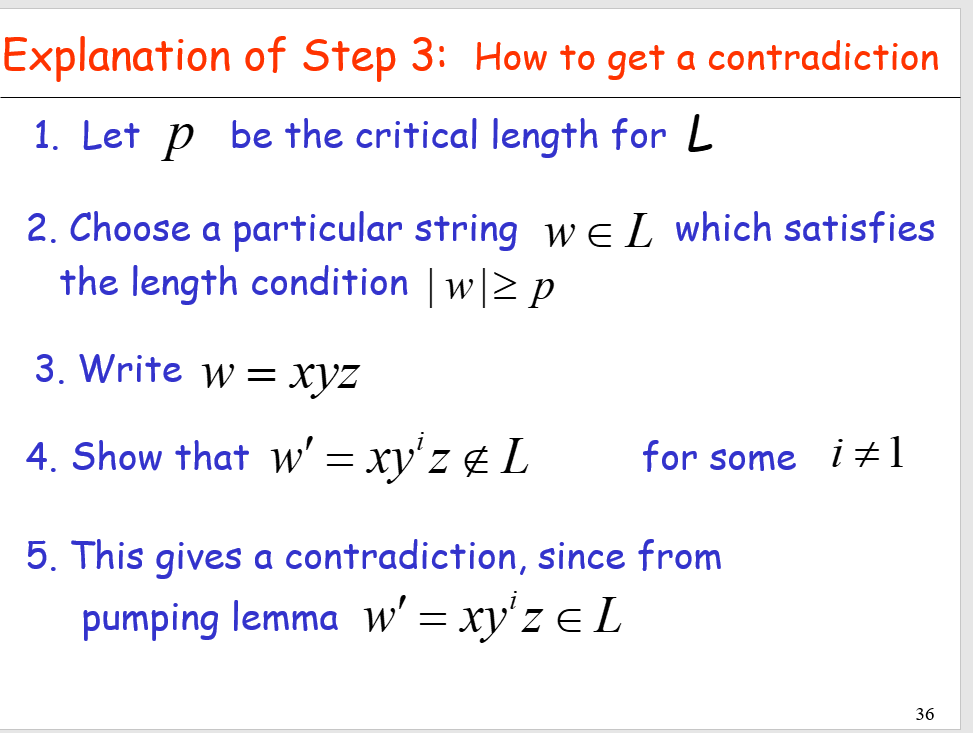
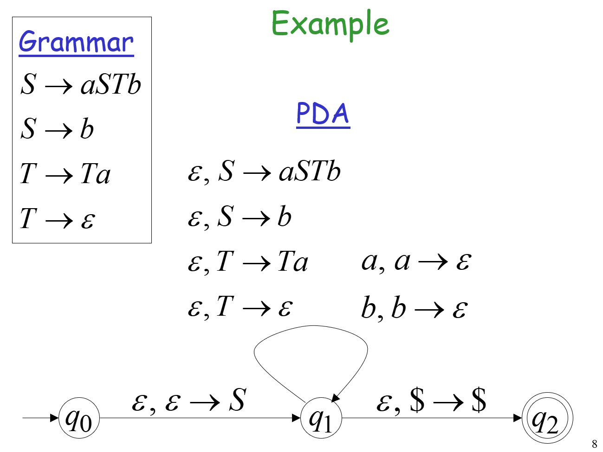
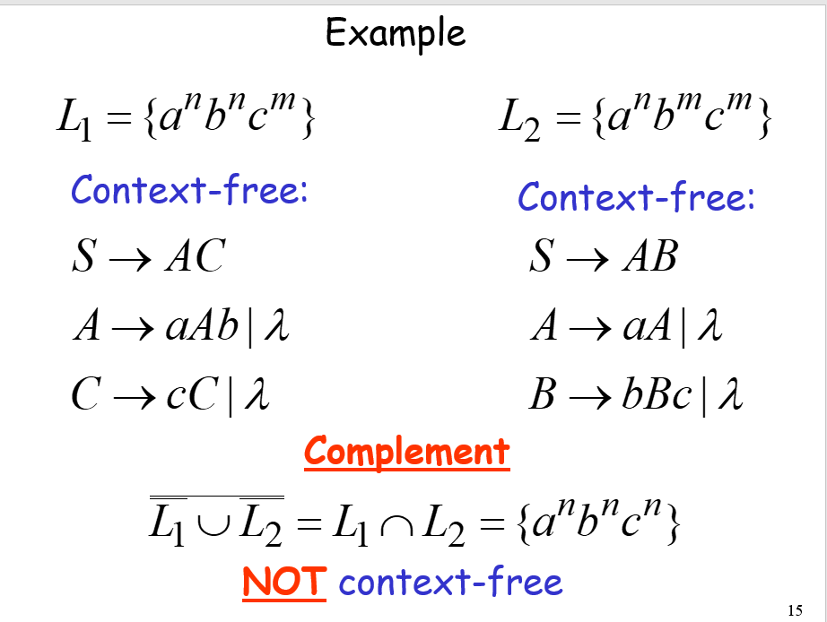
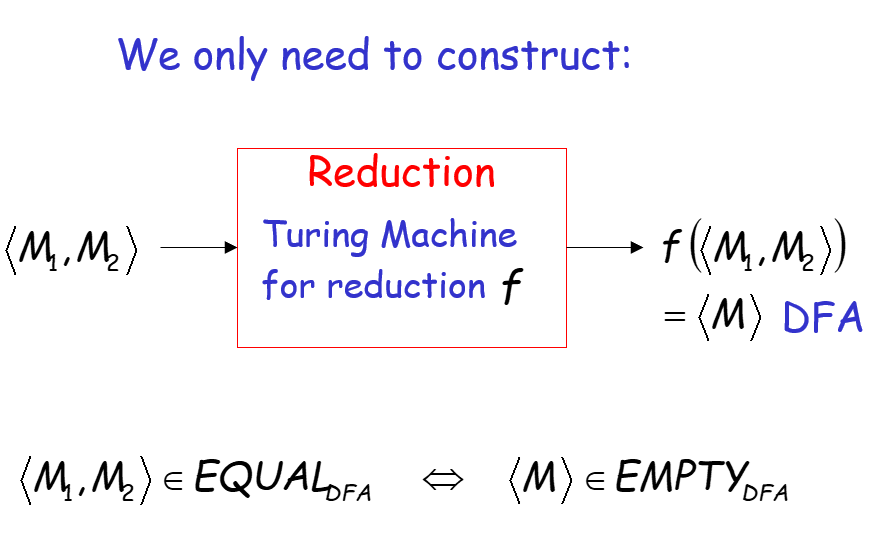
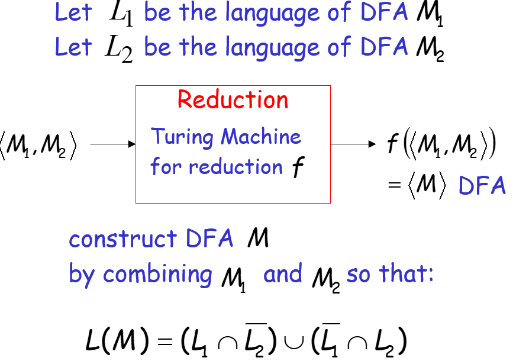
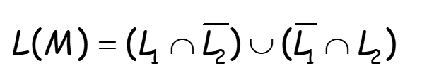
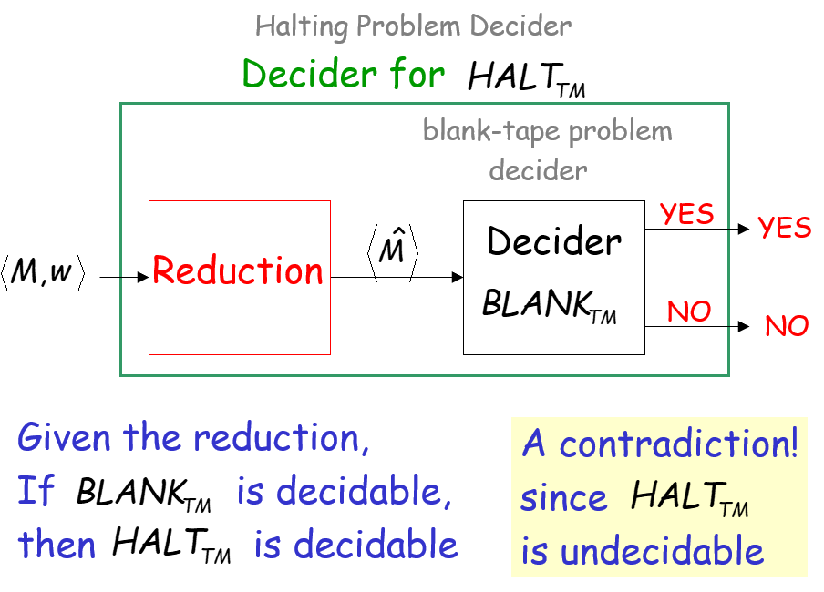

# 计算理论

## Language

 语言：字符串的集合。

语言可以作为集合进行交并补运算

​                           

## DFA

Deterministic Finite Automata 确定性有限状态自动机

输入：Sting

输出：“Accept” or “Reject”

#### 转移图


对于每个状态，每个字母都有一个箭头。（如图是只接受“abba”的状态机）

只有所有字符都被扫描，并且停在终止状态，才算接收。

#### 正则语言

语言L是正则的，如果存在一个DFA接收它。

比如：


不是正则语言。（没有DFA能接收）

## NFA

Non-Deterministic Finite Automata 

非确定性有限状态自动机，不要求每个状态都有出路。

**接收：**如果存在一条路径能消耗完所有字符并走到终止装态，就OK。如下图。


**拒绝：**

对于任何一个可能的路径：

- 所有字符都被消耗，并停在非接收状态。

- **或输入的字符串不能被消耗。（新增）**

  

#### Epsilon Transitions

无需任何条件，不消耗字符的转移。

如下图aa被接收，但是aaa不会被接收。


#### NFA的能力


## 正则语言

正则语言的运算闭包：交并补，连接，星，转置，仍是正则语言。


证明：

reverse是闭合的：状态转换函数调个，起始终止对调（所有方向箭头换向）

求补运算是闭合的：是否接受状态对调


## 正则表达式

描述正则语言的表达式


## 正则文法Grammar

```
S->aSb
...
```

一系列变量(S)替换式。

**线性文法**

表达式里最多只有一个变量

左线性文法：这个变量在表达式最左侧

正则文法 =线性文法或右线性文法


**正则文法生成的语言 = 正则语言**


## **正则泵引理**

利用鸽笼原理:如果是正则语言，若字符串xyz<p属于该正则语言，则xy^2z>p也属于该正则语言（p是该DFA的状态数）

一个有限的语言一定是正则语言（因为有限情况可以轻易构造NFA来接收每个字符）

> 证明某个语言不是正则语言。

反证法证明：

- 假设L是正则语言
- 那么应该符合泵引理
- 应用泵引理找到矛盾
- 所以L不是正则的

如何找到矛盾：

!


## 上下文无关语言

Context_Free

parse tree 语法分析树

衍生树（派生树）


**乔姆斯基范式**


## 上下文无关

**上下文无关的意思是**：只要文法的定义里有某个产生式，不管一个非终结符前后文是什么，都可以替换。（大概就是说可以根据产生式无条件替换）

上下文无关文法：所有产生式的形式都是`A->S`

上下文无关语言的交、补运算不是闭合的                 

$L_1L_2$属于上下文无关语言，A交B不属于上下文无关语言


**派生**

最左派生就是每次替换最左边的字符。

派生树：有时，派生顺序不通，但派生树会相同

**二异性**

想生成某个字符串，会有两个不同的派生树

二异性文法：某字符串有两个派生树（或两个最左派生)

有些语言本身就是二异性的.


## 上下文无关文法的简化


## PDA下推自动机

Pushdown Automata

包含一个栈结构

表示，扫描字符a，b出栈，c入栈


上下文无关语言 = 被PDA接收的语言

PDA默认是指Non-DPDA(非确定性下推自动机)  		

//这里的确定性指的是不能有两条可选的转移路径就行

注意，DPDA的能力小于PDA


上下文无关语言和正则语言的交是上下文无关语言

**上下文无关语言的泵引理**
uvxyz


## 图灵机


有临时内存（一个无限长的磁带）

图灵机有停机功能，没有转移可走就会停机。

接收：到了接收状态就停机，接收。（也就是说到终止状态没有可用的转移就算接收了，不管字符串是否消耗完）

拒绝：停止于非接收状态，或死循环


如果语言L可以被图灵机接收，则为图灵可识别语言。(图灵可接收语言，递归可枚举语言)

可构造枚举器进行证明


图灵机的变种

通用图灵机（可再编程）


## **可判定语言**

**图灵可接受，图灵可识别，递归可枚举语言**：存在一个图灵机M可以接受L

什么叫不可接受：死循环、或停在不可接受状态

**可判定语言的定义**

如果存在一个图灵机（decider）可接受L中的任意一个字符串

**判定器**

对于任何输入的string，计算都在接受或拒绝状态下停止，它就成为了一个判定器。一个图灵机，可进行改造：把多个Accept状态都指向一个最终的Accept状态，把其他可能停止的状态都指向一个Reject状态。这样，就成了一个decider

如果一个问题对应的语言是可判定语言，就说这个问题是可解的（solvable）

**可判断语言(可解问题):**

$PRIMES_X$

**$EMPTY_{DFA}$** 是判断一个DFA是否接受空语言。

$A_{DFA}$  DFA是否可以接收一个字符串M

$EQUAL_{DFA}$ 两个DFAM1,M2 是否接收同样的语言。







L是图灵可识别，但L补不是可识别，那么L补不是可判定，L也不是可判定。

在图灵可识别语言里，也有不可解的情况


**一些定理：**

如果一个语言是可判定的，那么它的补也是可判定的。


## **不可判定语言**

不可判定语言没有判断器。

有些语言是图灵可识别的，但是不可判定

$A_{TM}$ ：图灵机是否接收字符串w，是不可判定的

​	如果这个可判定，那么所有的图灵可识别语言都是可判定的。

$HALT_{TM}$： 不可判定。

​	同理。可以构造L作为图灵可识别语言的判断器。



## Reductions规约

A->B

A规约到B，简化，条件变少，字符串集合范围变大。但B是一个更普适的问题。

**TH1:**	A->B，B可判定，则A可判定

#### 规约例题1


例子：把Equal_DFA 规约为 Empty_DFA

"M1=M2" 等价转化为:  "L(M) = ∅"



该"L(M) 是否为空"的问题包含于"M是否为空?"这个问题。





TH2：A->B

如果A是不可判定的，那么B也是不可判定的。（假设B是可判定的，那么A也是可判定的，导出矛盾）


> 证明B是不可判定的

找到一个不可判定问题A，能够规约到B


#### 规约例题2

状态进入问题$STATE$：图灵机M在输入w后是否会进入q	(不可判断问题)

停机问题$HALT$可以规约到该问题，前者是不可判断的，所以该问题也不可判断。

构造规约f(w)（当且仅当，即一一映射），然后反证即可


#### 规约问题3

空磁带问题：图灵机M在空磁带上是否会停机？




M是空磁带是否停机问题，M^是是否停机问题。

**th3**: A->B非，A不可判定，B就不可判定

> 证明B是不可判定的思路：规约到B或B的补


$A_{TM} -> EMPTY_{TM}的非$


## 时间复杂度

哈密尔顿路径，从S->T并路过所有点

K-CLIQUE问题

sat问题

复杂度

P：有多项是时间算法

NP：给定一个解，非确定性图灵机在多项式时间内可以验证

NP完全问题：属于NP难问题，所有np问题都能在多项式时间内规约到他

NP难问题：NP里面最难的，NP里所有问题都可以多项式规约到的，不可判定问题肯定是NP难


Vectex Cover：找一个点的子集，覆盖所有的边（所有的边都连接到该子集的点）


哈密尔顿到2SAT的规约


2SAT

## 22.可判断性的规约

